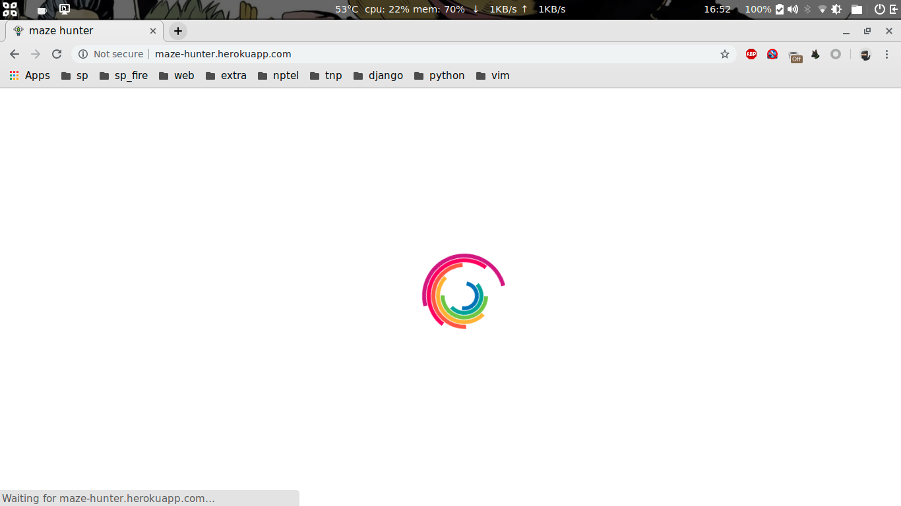
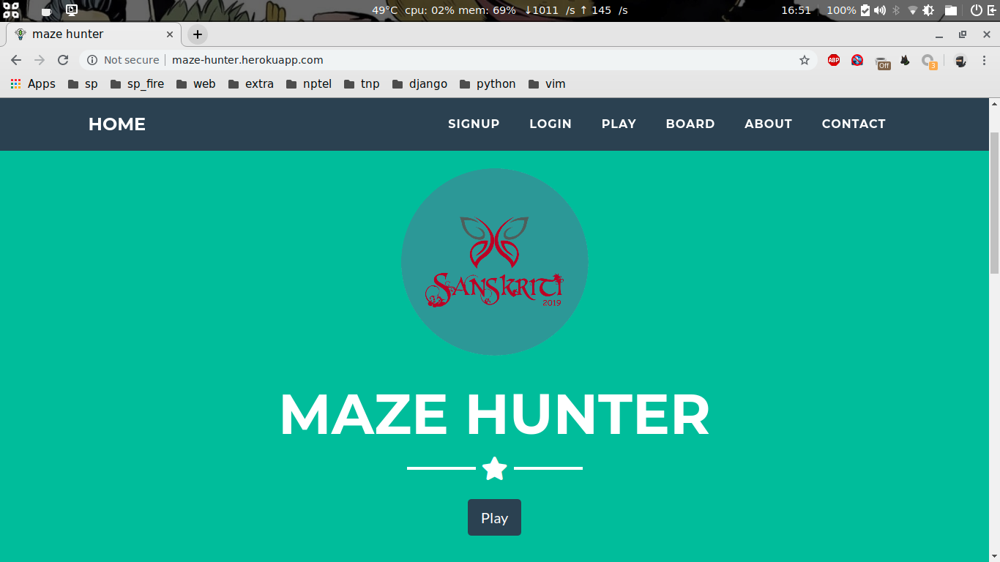
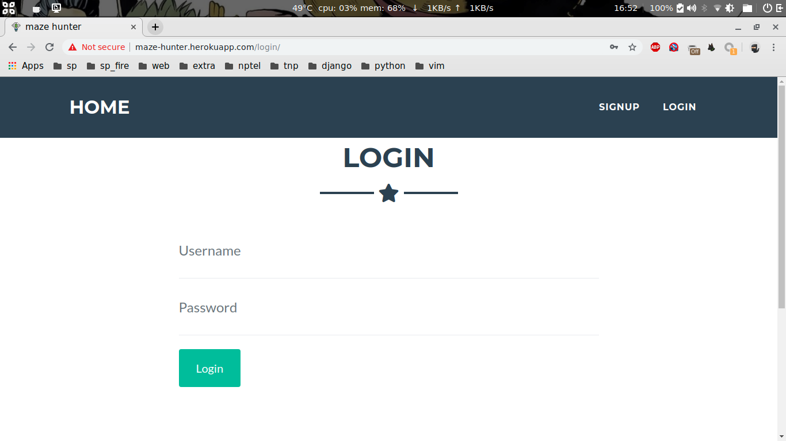
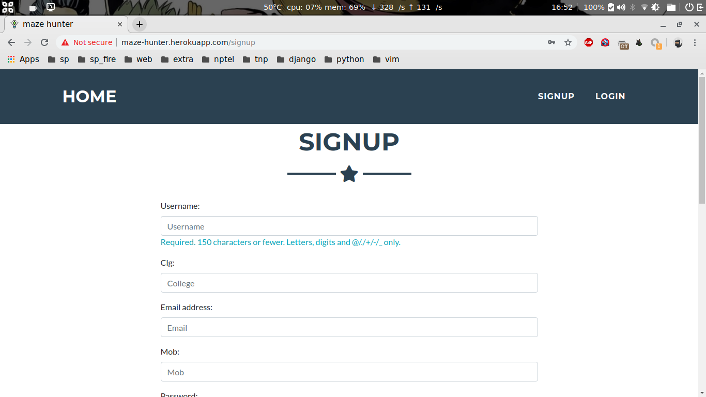
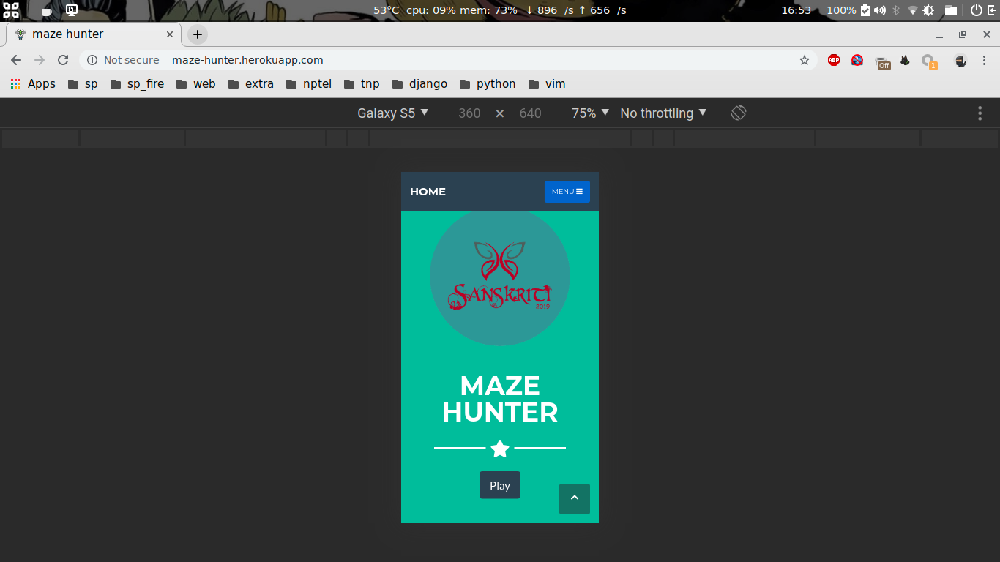
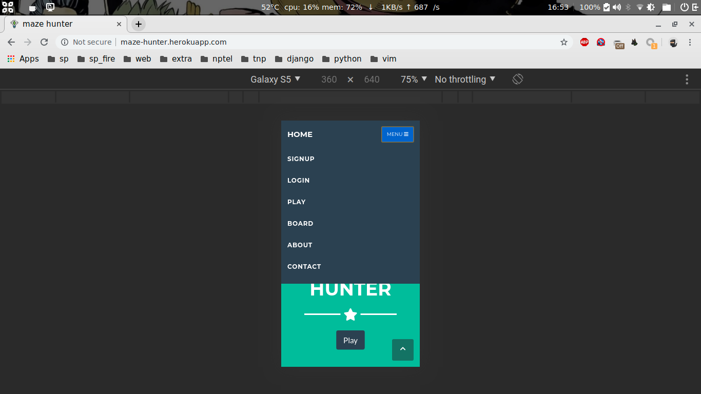

# maze-hunter

## Screenshots

### Loader

### Home page

### Login

### Signup

### Mobile view

--------

### Its a puzzle based online game created using django framework.

### It can be easily uploaded and hosted to heroku.

### Mobile compatible and has a count down timer.

### Provided support for PostgreSQL db, default db is SQLite3.

##  INSTALL ---------------------->

1)	git clone https://github.com/ask1234560/maze-hunter.git
2)	cd maze-hunter
3)	python3 must be installed
4)	pip3 install pipenv
### installs all required packages
5)	pipenv sync 			
6)	pipenv shell
### run the application in localhost:8000
7)	python manage.py runserver 8000	
### to view the website
8)	http://localhost:8000/			

